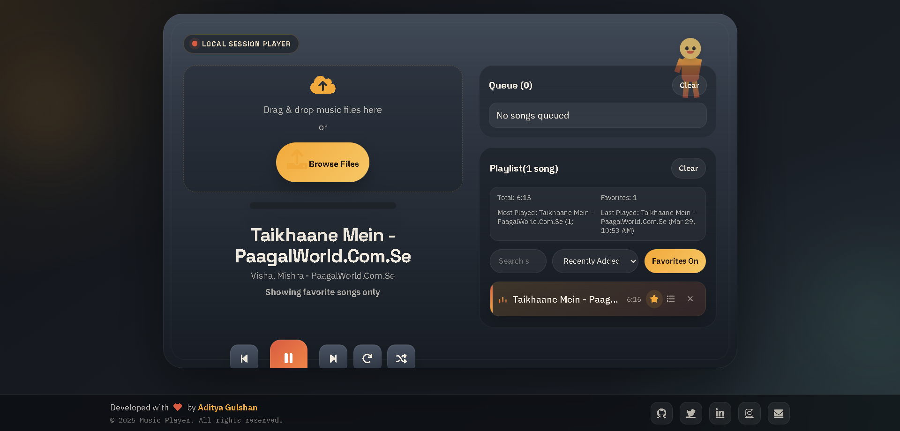

# PRK Music Player



A responsive retro cassette-style music player for local audio files. It runs fully in the browser and now includes playlist tools, queue management, saved songs, synced local lyrics, favorites, and session history.

## Highlights

- Retro cassette-themed UI with responsive desktop and mobile layouts
- Drag-and-drop uploads plus `Browse Files`
- Play, pause, previous, next, repeat, shuffle, volume, and draggable seek thumb
- Playback speed control and sleep timer
- Search, sorting, favorites, and playlist filtering
- Drag-and-drop playlist reordering
- Play-next queue with clear, remove, play-now, and drag reordering
- Metadata parsing for common ID3-tagged files
- Embedded album art support when available
- Local `.lrc` lyrics loading for the currently selected song
- Play history with `Most Played` and `Last Played` stats
- Toast notifications and live status messages
- Keyboard shortcuts for playback, navigation, seeking, and volume
- IndexedDB song persistence plus `localStorage` settings persistence

## Technologies Used

- HTML5
- CSS3
- JavaScript (ES6)
- `HTMLAudioElement`
- `FileReader`, `TextDecoder`, and browser file APIs
- IndexedDB for saved songs
- `localStorage` for settings, lyrics, queue, and history state
- Font Awesome
- Google Fonts (`Poppins`)

## Run Locally

No build step is required.

1. Open `index.html` in a modern browser.
2. Upload audio files with drag-and-drop or `Browse Files`.
3. Start playback from the playlist and explore the queue, favorites, lyrics, and sort tools.

## How To Use

1. Add songs with `Browse Files` or by dropping audio files into the upload area.
2. Click any song in the playlist to start playback.
3. Use the main controls for repeat, shuffle, next or previous, volume, speed, and sleep timer.
4. Use the playlist tools to search, sort, favorite, queue, remove, or reorder songs.
5. Load a `.lrc` file in the Lyrics panel to show synced lyrics for the current song.

## Keyboard Shortcuts

- `Space`: Play or pause
- `ArrowRight`: Seek forward
- `ArrowLeft`: Seek backward
- `ArrowUp`: Increase volume
- `ArrowDown`: Decrease volume
- `N`: Next song
- `P`: Previous song

## Persistence

- Songs are stored locally with IndexedDB and can be restored after refresh.
- Player settings are saved in `localStorage`.
- Favorites, queue order, loaded lyrics data, playback speed, filters, and play history are also restored locally.

## File Structure

```text
PRK-Music-Player-main/
|-- index.html
|-- styles.css
|-- script.js
|-- README.md
|-- Capture5.PNG
```

## Current Limitations

- Metadata parsing is mainly aimed at common ID3-tagged files, especially many MP3s
- Lyrics support currently expects local `.lrc` files with time tags
- Some audio files may not include title, artist, duration, or cover metadata
- Saved songs and settings are local to the same browser and device

## Browser Support

Works best in current versions of:

- Google Chrome
- Microsoft Edge
- Mozilla Firefox
- Safari

Created by Aditya Gulshan.
